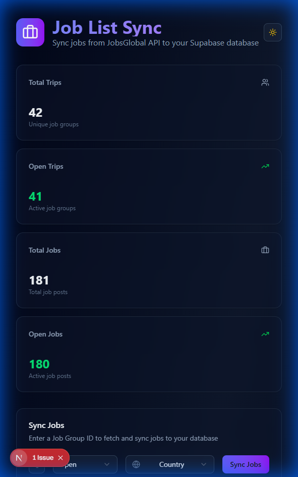
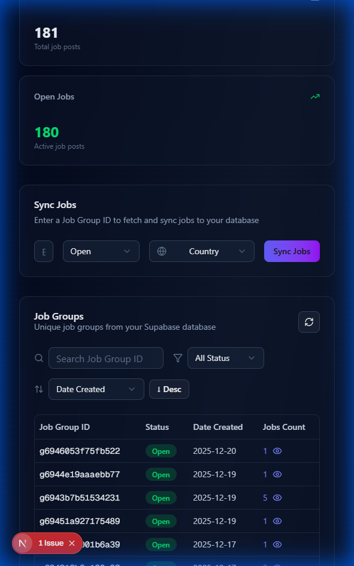
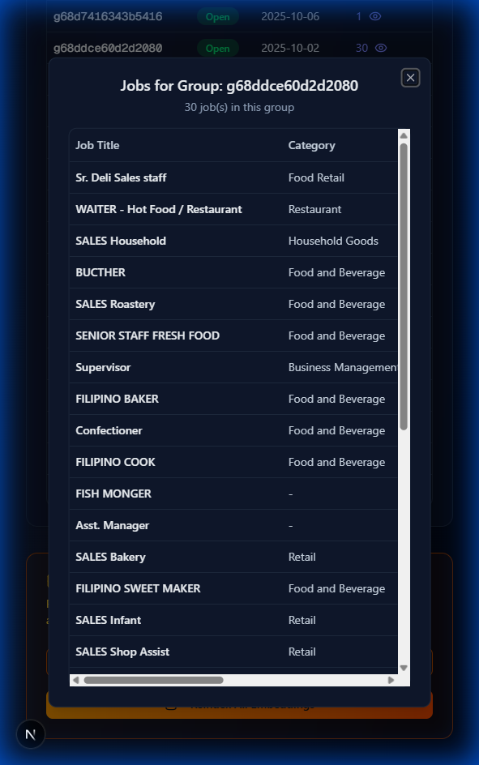
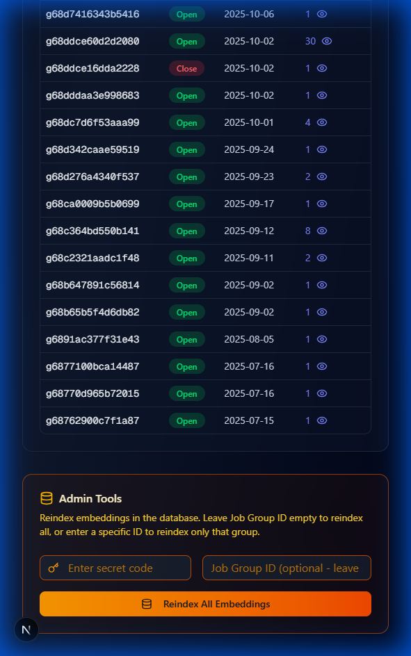

# Job List Sync

A full-stack application for syncing job listings from the JobsGlobal API to a Supabase database. This tool provides a modern dashboard interface to manage job groups, sync job data, and maintain vector embeddings for semantic search.



## 📋 Table of Contents

- [Features](#-features)
- [Tech Stack](#-tech-stack)
- [Project Structure](#-project-structure)
- [Prerequisites](#-prerequisites)
- [Configuration](#-configuration)
- [Installation](#-installation)
- [Running the Application](#-running-the-application)
- [Application Walkthrough](#-application-walkthrough)
- [API Endpoints](#-api-endpoints)
- [Database Schema](#-database-schema)

---

## ✨ Features

### Dashboard & Statistics

- **Real-time Statistics**: View total trips, open trips, total jobs, and open jobs at a glance
- **Job Groups Listing**: Browse all unique job groups with their status, creation date, and job count
- **Search & Filter**: Search by job group ID, filter by status (Open/Close), and sort by date or status

### Job Synchronization

- **Sync Jobs by Group ID**: Fetch and sync jobs from JobsGlobal API using a job group ID
- **Status Control**: Manually set job status as "Open" or "Close" during sync
- **Country Selection**: Select a fallback country if the API doesn't provide one
- **Automatic Embeddings**: Automatically rebuild vector embeddings when syncing jobs with "Open" status

### Job Management

- **Job Details Modal**: Click on job count to view all jobs within a specific job group
- **View Job Information**: See job title, category, country, status, date created, and email

### Admin Tools

- **Reindex Embeddings**: Rebuild vector embeddings for all jobs or a specific job group
- **Secret Code Protection**: Admin reindexing is protected with a secret code

### User Experience

- **Dark/Light Theme**: Toggle between dark and light modes
- **Responsive Design**: Works on desktop and tablet devices
- **Toast Notifications**: Real-time feedback on sync operations and errors

---

## 🛠 Tech Stack

### Backend

| Technology    | Version | Purpose               |
| ------------- | ------- | --------------------- |
| Python        | 3.10+   | Runtime               |
| FastAPI       | 0.109.0 | Web framework         |
| Uvicorn       | 0.27.0  | ASGI server           |
| Supabase      | 2.10.0  | Database client       |
| OpenAI        | 1.0.0+  | Embeddings generation |
| httpx         | 0.27.2  | HTTP client           |
| python-dotenv | 1.0.0   | Environment variables |

### Frontend

| Technology   | Version | Purpose             |
| ------------ | ------- | ------------------- |
| Next.js      | 16.1.0  | React framework     |
| React        | 19.2.3  | UI library          |
| TailwindCSS  | 4.x     | Styling             |
| Radix UI     | Various | UI components       |
| Lucide React | 0.562.0 | Icons               |
| Sonner       | 2.0.7   | Toast notifications |

---

## 📁 Project Structure

```
supabase-job-list-update/
├── .env                          # Environment variables (root)
├── README.md                     # This file
├── backend/
│   ├── main.py                   # FastAPI application entry point
│   ├── requirements.txt          # Python dependencies
│   ├── data/                     # Data files (destinations lookup)
│   └── services/
│       ├── embedding_service.py  # OpenAI embeddings management
│       ├── job_details.py        # Fetch jobs by group ID
│       ├── job_groups.py         # Job groups queries
│       ├── jobsglobal.py         # JobsGlobal API client
│       ├── mapper.py             # API response to DB mapping
│       └── supabase_client.py    # Supabase database client
└── frontend/
    ├── package.json              # Node.js dependencies
    ├── src/
    │   ├── app/
    │   │   ├── page.tsx          # Main dashboard page
    │   │   ├── layout.tsx        # Root layout
    │   │   └── providers.tsx     # Theme provider
    │   └── components/
    │       ├── ui/               # Reusable UI components
    │       ├── ThemeProvider.tsx # Dark/light theme
    │       └── ThemeToggle.tsx   # Theme toggle button
    └── public/                   # Static assets
```

---

## 📋 Prerequisites

Before running this application, ensure you have:

- **Python 3.10+** installed
- **Node.js 18+** and npm installed
- A **Supabase** project with the required table schema
- An **OpenAI API key** (for generating job embeddings)
- Access to the **JobsGlobal API**

---

## ⚙️ Configuration

Create a `.env` file in the **root** directory of the project with the following variables:

```env
# Supabase Configuration
SUPABASE_URL=https://your-project.supabase.co
SUPABASE_SERVICE_KEY=your-supabase-service-role-key

# OpenAI Configuration (for embeddings)
OPENAI_API_KEY=sk-your-openai-api-key

# Admin Protection
SECRET_EMBEDDING_CODE=your-secret-code-for-reindexing

# JobsGlobal API (if required)
JOBSGLOBAL_API_URL=https://api.jobsglobal.com
```

### Environment Variables Explained

| Variable                | Required    | Description                                             |
| ----------------------- | ----------- | ------------------------------------------------------- |
| `SUPABASE_URL`          | ✅ Yes      | Your Supabase project URL                               |
| `SUPABASE_SERVICE_KEY`  | ✅ Yes      | Supabase service role key (with write permissions)      |
| `OPENAI_API_KEY`        | ✅ Yes      | OpenAI API key for generating text embeddings           |
| `SECRET_EMBEDDING_CODE` | ✅ Yes      | Secret code to protect the reindex endpoint             |
| `JOBSGLOBAL_API_URL`    | ⚠️ Optional | Base URL for JobsGlobal API (if different from default) |

> [!CAUTION]
> Never commit your `.env` file to version control. The `.gitignore` is already configured to exclude it.

---

## 🚀 Installation

### 1. Clone the Repository

```bash
git clone <repository-url>
cd supabase-job-list-update
```

### 2. Backend Setup

```bash
# Navigate to backend directory
cd backend

# Create a virtual environment
python -m venv venv

# Activate virtual environment
# On Windows:
venv\Scripts\activate
# On macOS/Linux:
source venv/bin/activate

# Install dependencies
pip install -r requirements.txt
```

### 3. Frontend Setup

```bash
# Navigate to frontend directory
cd frontend

# Install dependencies
npm install
```

---

## ▶️ Running the Application

### Start the Backend Server

```bash
cd backend
uvicorn main:app --reload
```

The backend API will be available at: `http://localhost:8000`

### Start the Frontend Development Server

```bash
cd frontend
npm run dev
```

The frontend will be available at: `http://localhost:3000`

> [!TIP]
> Open two terminal windows - one for the backend and one for the frontend, and run both simultaneously.

---

## 📖 Application Walkthrough

### 1. Dashboard Overview

When you open the application at `http://localhost:3000`, you'll see the main dashboard:


**Stats Cards** (Top Section):

- **Total Trips**: Count of unique job groups in the database
- **Open Trips**: Number of job groups with "Open" status
- **Total Jobs**: Total number of job posts
- **Open Jobs**: Number of jobs with "Open" status

### 2. Syncing Jobs



**To sync jobs from JobsGlobal:**

1. Enter the **Job Group ID** in the input field (e.g., `g6926375a9187f16`)
2. Select the **Status** (Open or Close)
3. Optionally select a **Country** from the dropdown (used as fallback if API doesn't provide one)
4. Click **Sync Jobs**

The application will:

- Fetch job data from the JobsGlobal API
- Upsert (insert or update) jobs to Supabase
- If status is "Open", automatically rebuild vector embeddings
- Display the synced jobs in a results table

### 3. Viewing Job Groups

The **Job Groups** section shows all unique job groups:

- **Search**: Type a job group ID to search
- **Filter**: Filter by status (All, Open, Close)
- **Sort**: Sort by date created or status (ascending/descending)
- **Job Count**: Click the number with the 👁 icon to view all jobs in that group

### 4. Viewing Jobs in a Group



Click on any **Job Count** number to open a modal showing all jobs in that group:

- Job Title
- Category
- Country
- Status (badge indicator)
- Date Created
- Email

### 5. Admin Tools - Reindexing Embeddings



At the bottom of the dashboard, you'll find the **Admin Tools** section:

1. Enter the **Secret Code** (configured in `.env` as `SECRET_EMBEDDING_CODE`)
2. Optionally enter a **Job Group ID** to reindex only that group
3. Click **Reindex All Embeddings** (or the specific group)

> [!IMPORTANT]
> Reindexing all embeddings can take several minutes depending on the number of jobs in your database.

### 6. Theme Toggle

Click the **sun/moon icon** in the top-right corner to switch between light and dark modes.

---

## 🔌 API Endpoints

| Method | Endpoint                   | Description                                |
| ------ | -------------------------- | ------------------------------------------ |
| `GET`  | `/`                        | Health check                               |
| `POST` | `/api/sync-jobs`           | Sync jobs from JobsGlobal to Supabase      |
| `GET`  | `/api/job-groups`          | List all job groups with filtering/sorting |
| `GET`  | `/api/jobs/{job_group_id}` | Get all jobs for a specific group          |
| `GET`  | `/api/stats`               | Get summary statistics                     |
| `GET`  | `/api/countries`           | List all available countries               |
| `POST` | `/api/reindex-all`         | Reindex embeddings (protected)             |

### Example: Sync Jobs Request

```bash
curl -X POST http://localhost:8000/api/sync-jobs \
  -H "Content-Type: application/json" \
  -d '{
    "job_group_id": "g6926375a9187f16",
    "status": "Open",
    "country": "Philippines"
  }'
```

---

## 🗄 Database Schema

The application requires a `job_list` table in Supabase with the following schema:

```sql
CREATE TABLE job_list (
  id SERIAL PRIMARY KEY,
  job_group_id TEXT NOT NULL,
  job_post_id TEXT NOT NULL UNIQUE,
  job_title TEXT NOT NULL,
  email TEXT,
  apply_link TEXT,
  image_link TEXT,
  category TEXT,
  country TEXT,
  status TEXT,
  date_created TIMESTAMP WITH TIME ZONE,
  embedding VECTOR(1536)  -- For OpenAI text-embedding-ada-002
);

-- Create indexes for performance
CREATE INDEX idx_job_group_id ON job_list(job_group_id);
CREATE INDEX idx_status ON job_list(status);
CREATE INDEX idx_date_created ON job_list(date_created);
```

> [!NOTE]
> The `embedding` column uses the `vector` extension for Supabase/PostgreSQL to enable semantic search capabilities.

---

## 📝 License

This project is proprietary software. All rights reserved.

---

## 🤝 Support

For questions or issues, please contact the development team.
